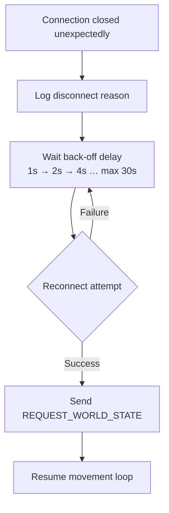

# Phase 2 — Client Design Document

## Overview

Phase 2 adds two new responsibilities to the client that were either deferred from Phase 1 or are required to support the new server capabilities:

1. **Auto-Reconnect** — The client automatically re-establishes its WebSocket connection if it drops unexpectedly.
2. **`HEX_CREATED` Message Handling** — The client receives and processes the new server broadcast sent when a new hex tile is generated in the world.

---

## 1. Auto-Reconnect

### Behaviour

When the WebSocket connection is closed unexpectedly (i.e., not initiated by the client itself), the client:

1. Logs a warning with the disconnect reason.
2. Waits for an exponential back-off delay before attempting to reconnect (starting at 1 s, doubling each attempt, capping at 30 s).
3. Re-sends a `REQUEST_WORLD_STATE` after a successful reconnect to re-sync local state.
4. Resumes the autonomous movement loop.

### Flow



### Configuration Constants

| Constant | Value | Description |
|----------|-------|-------------|
| `RECONNECT_BASE_DELAY_S` | 1 | Initial wait before first retry (seconds) |
| `RECONNECT_MAX_DELAY_S` | 30 | Maximum wait between retries (seconds) |
| `RECONNECT_BACKOFF_FACTOR` | 2 | Multiplier applied each failed attempt |

---

## 2. HEX_CREATED Message Handling

### When Received

The server broadcasts `HEX_CREATED` to the client only when **all** of the following are true:

- A new hex tile has been generated (because a mob moved outside existing tiles).
- The client's mob is within **100 units** of the new tile's centre.

### Handler Responsibilities

1. Parse the `hexId`, `tileData` fields from the payload (see `websocket_messages.json`).
2. Add the new tile entry to `ClientState.worldTiles` keyed by `hexId`.
3. Log an info entry: `"New hex tile created at (centerX, centerY)"`.

### Local State Update

```python
# Pseudo-code
def handle_hex_created(self, payload: dict):
    hex_id = payload["hexId"]
    tile_data = payload["tileData"]
    self.state.worldTiles[hex_id] = tile_data
    logging.info(
        f"HEX_CREATED: new tile {hex_id} at "
        f"({tile_data['location']['centerX']}, {tile_data['location']['centerY']})"
    )
```

---

## 3. Updated Message Handler Table

| Message | Phase | Handler |
|---------|-------|---------|
| `TICK_COMPLETE` | 1 | Unblock movement loop |
| `MOB_UPDATE` | 1 | Update `ClientState.mobs[mobId]` |
| `WORLD_UPDATE` | 1 | Update `ClientState.worldTiles` |
| `ERROR` | 1 | Log errorCode + errorMessage |
| `HEX_CREATED` | **2** | Add new tile to `ClientState.worldTiles` |

---

## 4. Relevant Files

| File | Role |
|------|------|
| `client/websocket_client.py` | Primary implementation target |
| `server_doc/websocket_messages.json` | Defines `HEX_CREATED` message schema |
| `client_doc/client_phase1.md` | Phase 1 design for reference |
| `client_doc/client_tasks.md` | Phase 2 task checklist |

---

## 5. Verification Plan

### Unit Tests
- `test_auto_reconnect_backoff` — Simulate connection drop; assert reconnect is attempted with exponential back-off delays.
- `test_hex_created_handler` — Send a mock `HEX_CREATED` payload; assert `ClientState.worldTiles` is updated with the new tile.

### Integration Tests
- Run client against a live server; manually kill the server process and restart it; confirm the client reconnects and resumes movement without manual intervention.
- Move a mob far from the origin to trigger hex creation; confirm the client receives and stores the `HEX_CREATED` message.

---

## 6. Further Considerations (Future Phases)

- **Phase 3**: The client may need to track which tiles are "known" vs newly created to support region-of-interest queries.
- **Future**: Configurable reconnect strategy (fixed vs exponential vs manual) exposed as a client CLI argument.
