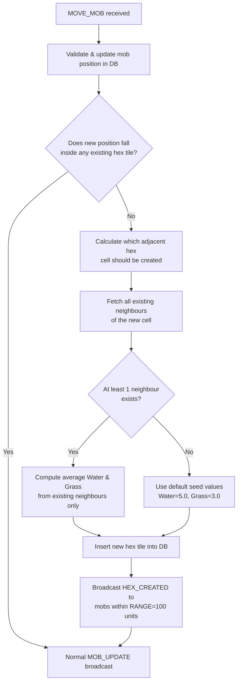

# Phase 2 — Server Design Document

## Overview

Phase 2 extends the server with two responsibilities:

1. **Dynamic Hex Tile Generation** — When a mob moves to coordinates that fall outside every existing hex tile, the server automatically generates a new adjacent tile and persists it to the database. The new tile's terrain values (`Water`, `Grass`) are seeded as the arithmetic mean of all *existing* neighbour tiles.
2. **Range-Limited `HEX_CREATED` Broadcast** — After creating a new tile, the server notifies only those clients whose controlled mobs are within a defined range constant of the new tile's centre.

---

## 1. Boundary Detection

After processing a `MOVE_MOB` command and updating the mob's position, the server checks whether the mob's new `(x, y)` coordinates fall inside any existing hex tile in the database.

### Algorithm



### Point-in-Hex Check

Each hex tile stores its six corner points (`hexcp1`–`hexcp6`) in the database. The server uses a standard polygon point-in-polygon test against those corners to determine containment.

---

## 2. Hex Grid Coordinate System

The game world uses a **flat-top axial hex grid** with a hex radius of **5 units** (centre to corner). Neighbouring hex centres are offset by:

| Direction | Axial offset (col, row) | Cartesian Δ (x, y) |
|-----------|------------------------|---------------------|
| Right      | (+1,  0) | (+10,   0)    |
| Left       | (-1,  0) | (-10,   0)    |
| Upper-Right| (+1, -1) | (+5, -8.66)   |
| Upper-Left | ( 0, -1) | (-5, -8.66)   |
| Lower-Right| ( 0, +1) | (+5, +8.66)   |
| Lower-Left | (-1, +1) | (-5, +8.66)   |

*(√3 × hex_radius ≈ 8.66 for radius = 5)*

When a mob position has no containing tile, the server determines the nearest axial grid position and creates the tile whose centre is closest to the mob.

---

## 3. Neighbour-Averaging Formula

```
new_Water = mean(Water_i  for each neighbour_i that exists in DB)
new_Grass = mean(Grass_i  for each neighbour_i that exists in DB)
```

- **Missing neighbours are excluded** — they do not contribute a zero or any other value.
- If **no neighbours exist** (edge case), defaults are used: `Water = 5.0`, `Grass = 3.0`.
- Values are stored as `Real` (floating-point) in the database, matching the existing schema.

---

## 4. New Hex Tile Record

The server constructs the full `HexTileSchema` record for the new tile:

| Field       | Source                                        |
|-------------|-----------------------------------------------|
| `centerX`   | Calculated from axial grid position           |
| `centerY`   | Calculated from axial grid position           |
| `centerXY`  | JSON array `[centerX, centerY]`               |
| `hexcp1–6`  | Computed from centre + flat-top hex geometry  |
| `hexcp7`    | Repeat of `hexcp1` to close the polygon       |
| `loc`       | GeoJSON Polygon built from corner points      |
| `Water`     | Average of existing neighbours (or default)   |
| `Grass`     | Average of existing neighbours (or default)   |
| `Created`   | UTC timestamp at creation time                |
| `Updated`   | Same as `Created` on first insert             |

---

## 5. HEX_CREATED Broadcast (Range-Limited)

After a new tile is created and committed to the database, the server broadcasts a `HEX_CREATED` message **only** to clients whose mobs are within **100 units** of the new tile's centre.

```
distance = sqrt((mob_x - new_hex_centerX)^2 + (mob_y - new_hex_centerY)^2)
if distance <= HEX_CREATION_BROADCAST_RANGE:  # constant = 100
    send HEX_CREATED to that client
```

See `websocket_messages.json` for the full message schema.

### Design Rationale

Broadcasting world-expansion events only to nearby clients avoids unnecessary network traffic in large worlds. The constant `HEX_CREATION_BROADCAST_RANGE = 100` is defined in server configuration and may be adjusted in future phases.

---

## 6. Server Configuration Constants (Phase 2)

| Constant                         | Value  | Description                                           |
|----------------------------------|--------|-------------------------------------------------------|
| `HEX_RADIUS`                     | 5      | Units from hex centre to corner                       |
| `HEX_CREATION_BROADCAST_RANGE`   | 100    | Max distance (units) for `HEX_CREATED` broadcast      |
| `DEFAULT_WATER`                  | 5.0    | Seed value when no neighbours exist                   |
| `DEFAULT_GRASS`                  | 3.0    | Seed value when no neighbours exist                   |

---

## 7. Relevant Files

| File | Role |
|------|------|
| `server/server.py` | Primary implementation target |
| `HexTileSchema.md` | Database schema for hex tiles |
| `MobSchema.md` | Database schema for mobs |
| `server_doc/websocket_messages.json` | Message schema including `HEX_CREATED` |
| `server_doc/server_phase1.md` | Phase 1 reference for existing server design |

---

## 8. Verification Plan

### Unit Tests
- `test_boundary_detection` — Mock a mob position outside all existing tiles; assert new tile creation is triggered.
- `test_neighbour_averaging` — Provide 3 mock neighbours with known Water/Grass values; assert new tile values equal the arithmetic mean.
- `test_zero_neighbours_defaults` — No neighbours in DB; assert `Water=5.0`, `Grass=3.0`.
- `test_hex_created_range_filter` — Mock mobs at varying distances; assert only those within 100 units receive `HEX_CREATED`.

### Integration Tests
- Start server → connect client → move mob far from origin → query DB and assert new tile row exists with correct Water/Grass.
- Verify `HEX_CREATED` message is received by nearby clients only.

---

## 9. Further Considerations (Future Phases)

- **Tile removal / decay**: Tiles with zero Water and zero Grass for extended periods could be candidates for merging or removal (Phase 3+).
- **Configurable broadcast range**: Expose `HEX_CREATION_BROADCAST_RANGE` as a server runtime setting (Phase 3+).
- **Chunk-based loading**: As the world grows, chunk streaming to clients may replace snapshot broadcasts.
