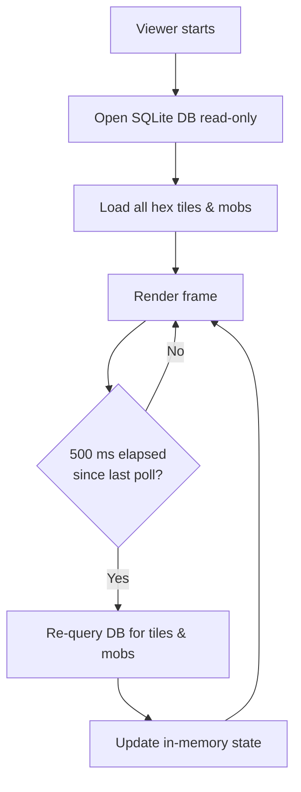

# Phase 2 — Viewer Design Document

## Overview

The Phase 2 viewer is a **read-only** Pygame application that connects directly to the SQLite database and renders the live game world. It requires no WebSocket connection and never writes to the database.

### Goals

- Render all hex tiles stored in the database with terrain-based colouring.
- Render all alive mobs as coloured dots with type-based colouring.
- Allow the user to **pan** and **zoom** the camera to explore the world.
- Poll the database at a **fixed 500 ms wall-clock interval** to pick up new tiles and mob state changes.

---

## 1. Technology Stack

| Layer | Choice |
|-------|--------|
| Language | Python |
| Rendering | Pygame |
| Database | SQLite3 (read-only, same `game_state.db`) |
| No WebSocket | Viewer does **not** connect to the server |

---

## 2. Rendering Rules

### 2.1 Hex Tile Colours

Each tile is filled as a solid polygon drawn using the six corner points stored in the database.

| Condition | Colour | Hex Code |
|-----------|--------|----------|
| `Grass > 0` (any grass present) | Green | `#4CAF50` |
| `Grass == 0` AND `Water > 50` | Blue | `#2196F3` |
| `Grass == 0` AND `Water == 0` | Brown | `#795548` |
| `Grass == 0` AND `0 < Water <= 50` | Muted teal | `#607D8B` |

*(The muted-teal row handles the in-between case not explicitly defined — it blends water with no grass.)*

### 2.2 Mob Colours

Mobs are rendered as filled circles (radius ≈ 4 screen pixels before zoom) at their `(x, y)` position.

| `mob_type` | Dot Colour |
|------------|------------|
| `predator` | Red `#F44336` |
| `prey` | Yellow `#FFEB3B` |
| Unknown / other | White `#FFFFFF` |

### 2.3 Colour Legend

A fixed HUD panel is rendered in the **bottom-left corner** of the window showing:

```
■ Green  — Grass present
■ Blue   — Deep water (Water > 50, no grass)
■ Teal   — Shallow water (Water 1–50, no grass)
■ Brown  — Barren (no grass, no water)
● Red    — Predator mob
● Yellow — Prey mob
```

---

## 3. Camera System (Pan & Zoom)

### Controls

| Input | Action |
|-------|--------|
| Left-click + drag | Pan the world |
| Mouse scroll wheel up | Zoom in (increase scale factor) |
| Mouse scroll wheel down | Zoom out (decrease scale factor) |
| `R` key | Reset camera to origin and default zoom |

### Implementation

The camera transforms world coordinates to screen coordinates:

```
screen_x = (world_x - camera_offset_x) * zoom_factor + screen_center_x
screen_y = (world_y - camera_offset_y) * zoom_factor + screen_center_y
```

- **Zoom range**: 0.1× (minimum) to 10× (maximum).
- **Default zoom**: 1.0 (1 world unit = 1 screen pixel).
- Camera position stored as `(offset_x, offset_y)` in world-space units.

---

## 4. Database Polling



- The database is opened with `check_same_thread=False` in **read-only URI mode**: `sqlite:///path/to/game_state.db?mode=ro`.
- Only alive mobs are fetched: `mob_health.health > 0`.
- **Future phase note**: The 500 ms poll interval should be exposed as a user-adjustable setting in the viewer UI (e.g., a slider or text input while the viewer is running).

---

## 5. Window & Layout

| Property | Value |
|----------|-------|
| Default window size | 1280 × 720 |
| Target FPS | 60 |
| DB poll interval | 500 ms |
| Font | Pygame default (or system monospace) |

### Layout Zones

```
+--------------------------------------+
|                                      |
|          World Render Area           |
|      (hex tiles + mob dots)          |
|                                      |
|                                      |
+--------------------------------------+
| Legend HUD (bottom-left, fixed)      |
+--------------------------------------+
```

---

## 6. Application Entry Point

The viewer is launched as a standalone script:

```
python -m viewer.viewer_main
```

or

```
python viewer/viewer_main.py --db path/to/game_state.db
```

Default database path: `../game_state.db` (relative to the `viewer/` directory).

---

## 7. Module Structure

```
viewer/
  viewer_main.py      ← Entry point, Pygame init, main loop
  db_reader.py        ← Read-only DB queries for tiles and mobs
  renderer.py         ← Draw hex tiles, mobs, and HUD legend
  camera.py           ← Camera transform (pan + zoom)
```

---

## 8. Relevant Files

| File | Role |
|------|------|
| `HexTileSchema.md` | Defines tile fields queried from DB |
| `MobSchema.md` | Defines mob fields queried from DB |
| `game_state.db` | Live database read by viewer |
| `viewer_doc/viewer_tasks.md` | Task checklist for Phase 2 implementation |

---

## 9. Verification Plan

### Manual Verification
- Launch viewer against a populated database.
- Confirm tiles render with correct colours based on their Water/Grass values.
- Confirm mobs appear as coloured dots at correct positions.
- Pan with left-click drag — world moves smoothly.
- Scroll wheel zoom in/out — tiles and mobs scale correctly.
- Wait 500 ms after a client moves a mob — dot moves on next poll.
- Press `R` — camera resets.

### Automated Tests
- `test_colour_selection` — Given Water/Grass values, assert the correct colour constant is returned.
- `test_camera_transform` — Given known world coordinates and zoom, assert correct screen coordinates.

---

## 10. Further Considerations (Future Phases)

- **Phase 3**: Click on a tile → show tile info panel (Water, Grass, location).
- **Phase 3**: Click on a mob → show mob info panel (health, hunger, type, genes).
- **Future**: Adjustable poll interval setting exposed in the viewer UI at runtime.
